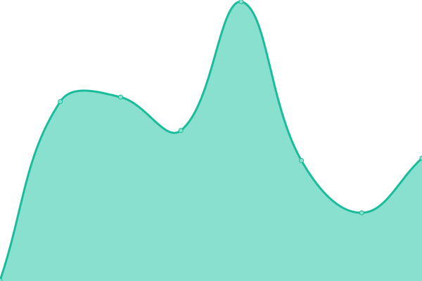
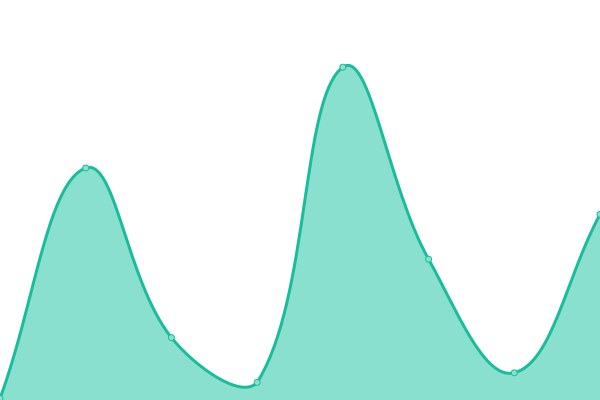
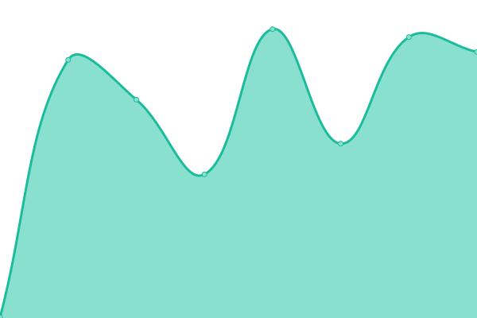
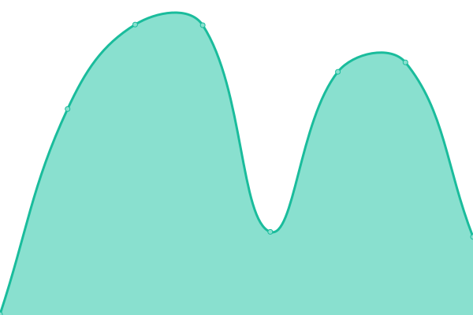
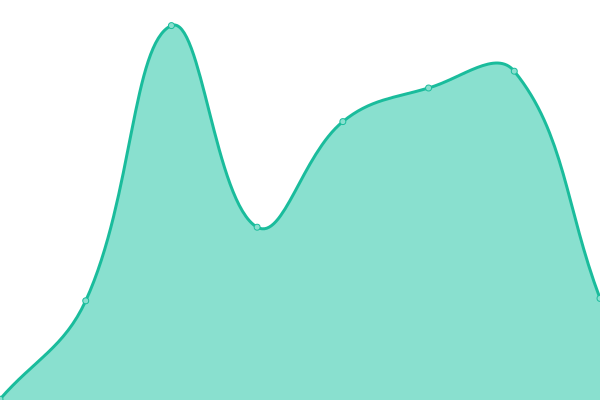

# [📈 Live Status](https://sirogamichandayo.github.io/my-upptime): <!--live status--> **🟩 All systems operational**

This repository contains the open-source uptime monitor and status page for [tomooka cota](https://sirogamichandayo.github.io/my-upptime), powered by [Upptime](https://github.com/upptime/upptime).

With [Upptime](https://upptime.js.org), you can get your own unlimited and free uptime monitor and status page, powered entirely by a GitHub repository. We use [Issues](https://github.com/sirogamichandayo/my-upptime/issues) as incident reports, [Actions](https://github.com/sirogamichandayo/my-upptime/actions) as uptime monitors, and [Pages](https://sirogamichandayo.github.io/my-upptime) for the status page.

<!--start: status pages-->
<!-- This summary is generated by Upptime (https://github.com/upptime/upptime) -->
<!-- Do not edit this manually, your changes will be overwritten -->
<!-- prettier-ignore -->
| URL | Status | History | Response Time | Uptime |
| --- | ------ | ------- | ------------- | ------ |
|  [AtCoderDatabase](https://atcoder-db.sirogami.com/) | 🟩 Up | [at-coder-database.yml](https://github.com/sirogamichandayo/my-upptime/commits/HEAD/history/at-coder-database.yml) | 

 1178ms
     
 | 

<a href="https://sirogamichandayo.github.io/my-upptime/history/at-coder-database">97.79%</a>
    

|  [User Algorithm Rating Retrieval](https://data.ac-predictor.com/ratings/algorithm.json) | 🟩 Up | [user-algorithm-rating-retrieval.yml](https://github.com/sirogamichandayo/my-upptime/commits/HEAD/history/user-algorithm-rating-retrieval.yml) | 

 307ms
     
 | 

<a href="https://sirogamichandayo.github.io/my-upptime/history/user-algorithm-rating-retrieval">100.00%</a>
    

|  [User Heuristic Rating Retrieval](https://data.ac-predictor.com/ratings/heuristic.json) | 🟩 Up | [user-heuristic-rating-retrieval.yml](https://github.com/sirogamichandayo/my-upptime/commits/HEAD/history/user-heuristic-rating-retrieval.yml) | 

 52ms
     
 | 

<a href="https://sirogamichandayo.github.io/my-upptime/history/user-heuristic-rating-retrieval">100.00%</a>
    

|  [User Algorithm Contest History Retrieval](https://atcoder.jp/users/sirogamichandayo/history/json) | 🟩 Up | [user-algorithm-contest-history-retrieval.yml](https://github.com/sirogamichandayo/my-upptime/commits/HEAD/history/user-algorithm-contest-history-retrieval.yml) | 

 256ms
     
 | 

<a href="https://sirogamichandayo.github.io/my-upptime/history/user-algorithm-contest-history-retrieval">100.00%</a>
    

|  [User Heuristic Contest History Retrieval](https://atcoder.jp/users/sirogamichandayo/history/json?contestType=heuristic) | 🟩 Up | [user-heuristic-contest-history-retrieval.yml](https://github.com/sirogamichandayo/my-upptime/commits/HEAD/history/user-heuristic-contest-history-retrieval.yml) | 

 299ms
     
 | 

<a href="https://sirogamichandayo.github.io/my-upptime/history/user-heuristic-contest-history-retrieval">100.00%</a>
    

|  [Submission Data Retrieval](https://kenkoooo.com/atcoder/atcoder-api/v3/from/9223372036854775807) | 🟩 Up | [submission-data-retrieval.yml](https://github.com/sirogamichandayo/my-upptime/commits/HEAD/history/submission-data-retrieval.yml) | 

 521ms
     
 | 

<a href="https://sirogamichandayo.github.io/my-upptime/history/submission-data-retrieval">100.00%</a>
    

|  [Problem List Retrieval](https://kenkoooo.com/atcoder/resources/problems.json) | 🟩 Up | [problem-list-retrieval.yml](https://github.com/sirogamichandayo/my-upptime/commits/HEAD/history/problem-list-retrieval.yml) | 

 153ms
     
 | 

<a href="https://sirogamichandayo.github.io/my-upptime/history/problem-list-retrieval">100.00%</a>
    

|  [Problem Model Retrieval](https://kenkoooo.com/atcoder/resources/problem-models.json) | 🟩 Up | [problem-model-retrieval.yml](https://github.com/sirogamichandayo/my-upptime/commits/HEAD/history/problem-model-retrieval.yml) | 

 152ms
     
 | 

<a href="https://sirogamichandayo.github.io/my-upptime/history/problem-model-retrieval">100.00%</a>
    

|  [Contest Information Retrieval](https://atcoder.jp/api/contests/abc001) | 🟩 Up | [contest-information-retrieval.yml](https://github.com/sirogamichandayo/my-upptime/commits/HEAD/history/contest-information-retrieval.yml) | 

 247ms
     
 | 

<a href="https://sirogamichandayo.github.io/my-upptime/history/contest-information-retrieval">100.00%</a>
    

<!--end: status pages-->

[**Visit our status website →**](https://sirogamichandayo.github.io/my-upptime)

## 📄 License

- Powered by: [Upptime](https://github.com/upptime/upptime)
- Code: [MIT](./LICENSE) © [Anand Chowdhary](https://anandchowdhary.com), supported by [Pabio](https://pabio.com)
- Data in the `./history` directory: [Open Database License](https://opendatacommons.org/licenses/odbl/1-0/)
